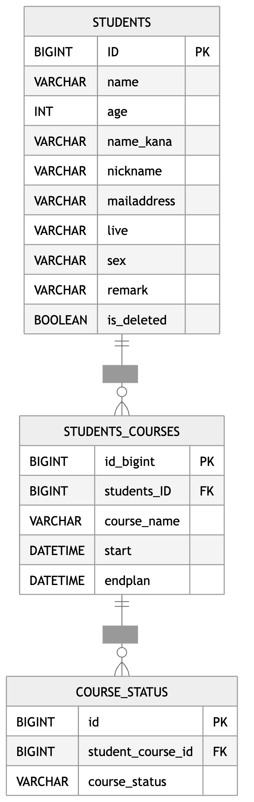
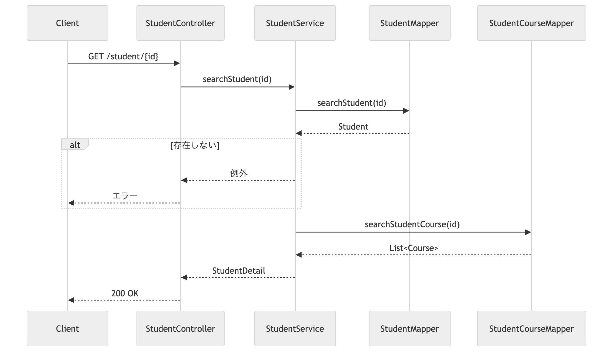
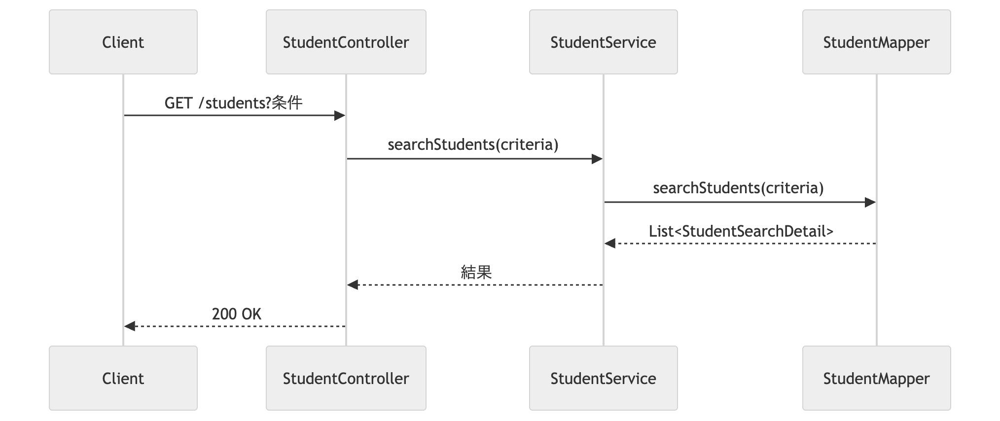
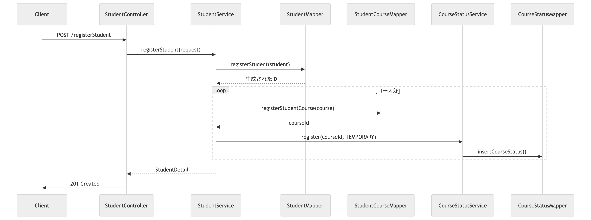
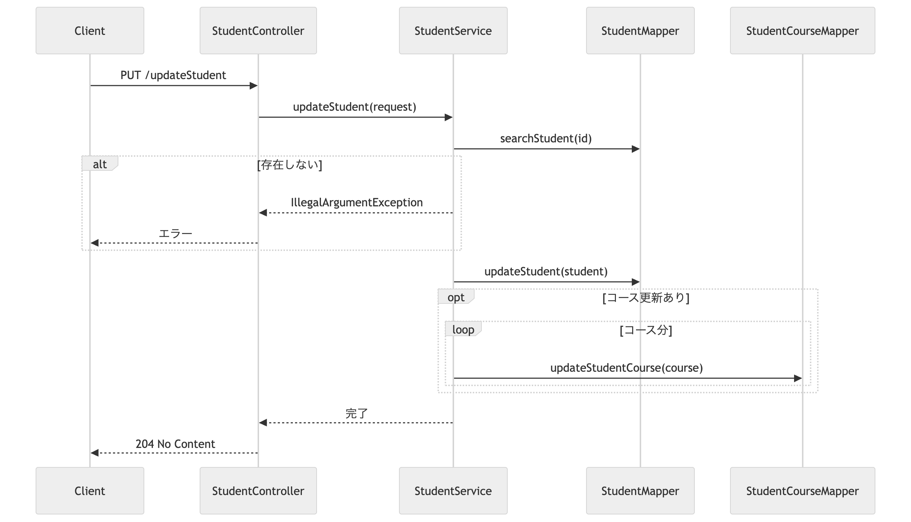
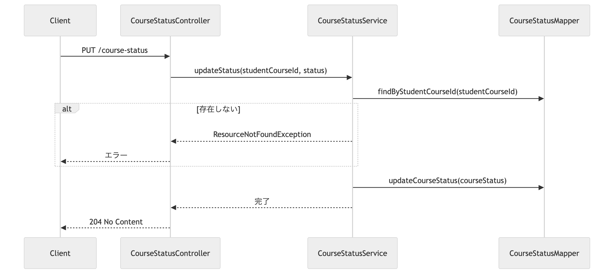

## サービス概要
このプロジェクトは、IT技術を教えるスクールが受講生の情報を保持・分析するための、「受講生管理システム」です。

スクールの運営者が使用することを想定しており、CURD操作中心のシンプルで分かりやすい設計を目指しています。

## 作成背景
JavaやSpring Bootの学習成果を形にするために作成しました。
実務で頻繁に使用される以下の技術やツールを採用しています。

## 主な使用技術
### バックエンド

### DB

### 使用ツール

## 機能一覧
| 機能                          | 内容                                                                  |
|:----------------------------|:--------------------------------------------------------------------|
| <nobr>受講生詳細の一覧検索            | <nobr>受講生詳細の一覧検索です。全件検索を行うので、条件指定は行いません。                            |
| <nobr>受講生詳細の個別検索(受講生ID指定)   | <nobr>受講生詳細検索の個別検索です。受講生IDを指定し、一意の受講生詳細を取得します。                      |
| <nobr>受講生詳細の条件検索            | <nobr>名前・受講コース・申込状況などの検索条件を指定し、条件に該当する受講生詳細を取得します。                  |
| <nobr>受講生詳細の登録              | 名前や居住地域などの受講生の情報と、受講コースをセットで登録します。                                  |
| <nobr>受講生詳細の更新              | 受講生IDを指定し、任意の受講生詳細を更新します。 ※削除処理については論理削除として実装しているため、更新処理として行います。 |
| <nobr>申込状況での検索             | 申込状況を指定し、該当する受講生詳細を取得します。                                           |
| <nobr>申込状況の更新            | IDを指定し、任意の申込状況を更新します。                                               |

## 使用イメージ
#### 絞り込み検索
<video src="video.mov/検索条件絞り込み.mov" controls width="100%"></video>

#### 新規登録
<video src="video.mov/受講生新規登録.mov" controls width="100%"></video>

#### 削除
<video src="video.mov/更新処理(論理削除).mov" controls width="100%"></video>

#### 申込状況を更新
<video src="video.mov/申込状況更新.mov" controls width="100%"></video>

### フォームバリデーション

## 設計書
### API仕様書
[SwaggerによるAPI仕様書](http://localhost:8080/swagger-ui/index.html)

### ER図(Entity-Relationship Diagram)
- 1人の受講生が複数コース持てます(1 : N) 
- 1つのコースに対して複数ステータス(仮申込、本申込、受講中、受講終了)が持てます(1 : N)

### APIのURL設計
| HTTP メソッド | URL              | 処理内容       |
|:-------------|:-----------------|:-----------|
| GET          | /studentList     | 受講生詳細の一覧検索 |
| GET          | /student/{id}    | 受講生詳細の個別検索(受講生ID指定)           |
| POST         | /RegisterStudent | 受講生詳細の登録 |
| PUT          | /UpdateStudent   | 受講生詳細の更新 |

### 画面遷移図

### シーケンス図
#### 受講生詳細の個別検索(受講生ID指定)フロー

#### 受講生詳細の条件検索フロー

#### 受講生詳細の登録フロー

#### 受講生詳細の更新フロー

#### 申込状況の更新フロー

## テスト
JUnitを用いて単体テストを実装しました。

### テストを行ったクラス
Controller
- CourseStatusController
- StudentController

Converter
- StudentConverter

Servece
- CourseStatusServece
- StudentService

Repository
- CourseStatusMapper
- StudentCourseMapper
- StudentMapper

## 力を入れたところ

## 今後の課題

